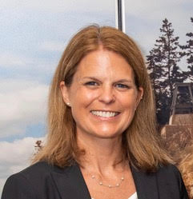
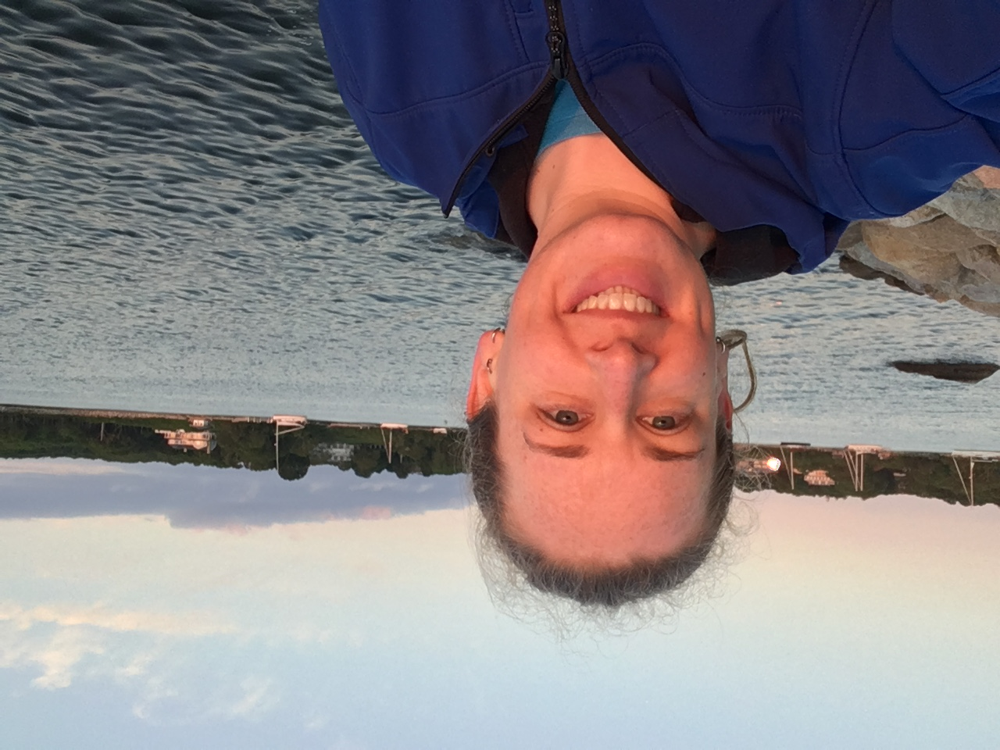
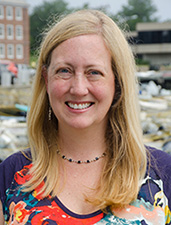
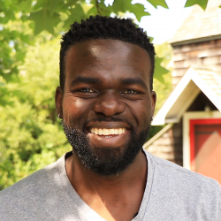

For this skill set, we are going to be thinking about the broader community around ourselves and our research interests. Initially, that is the community we find ourselves in in Woods Hole.

To get to know that community a little better, I've invited some guest speakers from a range of Woods Hole Institutions to come and give us an introduction to their research and how they found their way to this research community. You job in this level is to engage with the speakers and learn about some of the work that goes on in town.

## June 17th: Ocean Plastics [SEA]

### Dr. Kara Lavender Law

*Research Professor of Oceanography*

Dr. Kara Lavender Law is a Research Professor of Oceanography at Sea Education Association (SEA; Woods Hole, MA), studying the sources, distribution, transformation and fate of plastic debris in the ocean.  Trained as a physical oceanographer, Dr. Law has more than 12 months of sea time on oceanographic and sailing research vessels, including in the eastern North Pacific and western North Atlantic Oceans where plastic debris accumulates in regions dubbed, “garbage patches”.  Dr. Law’s current research interests focus on the sources of plastic to the marine environment, understanding how ocean physics determines the distribution of plastic and other marine debris, and the degradation and ultimate fate of different plastic materials in the ocean.  She serves on the U.S. National Academies Committee on U.S. Contributions to Global Ocean Plastic Waste, is vice-chair of the Scientific Committee on Oceanic Research (SCOR) Working Group FLOTSAM (Floating Litter and its Oceanic TranSport Analysis and Modelling), and served as the co-principal investigator of the Marine Debris Working Group at the National Center for Ecological Analysis and Synthesis (NCEAS). Dr. Law holds a PhD in physical oceanography from Scripps Institution of Oceanography and a BS in mathematics from Duke University.  

### Jessica Donohue

*Research Associate*

Jessica Donohue is a Research Associate at Sea Education Association (SEA; Woods Hole, MA), studying marine plastic debris both in the laboratory and from SEA’s sailing research vessels. Ms. Donohue works with microplastics collected using surface plankton nets onboard SEA vessels to determine polymer type and physical characteristics of these particles. This research advances the understanding of how these polymers behave and degrade in the marine environment, and the variability in the composition of microplastics in time and by region. She has an interest in science education outreach and has given numerous talks at public events and schools about the issue of plastic pollution in our oceans. Jessica holds an M.S. from the University of Rhode Island in environmental science/hydrogeology and a B.S. in environmental geology from Binghamton University. 

## June 22: Spinal Cord Regenration [MBL]

### Dr. Jennifer Morgan

*Director of the Eugene Bell Center*

*Associate Scientist, Marine Biological Laboratory*

Dr. Jennifer Morgan studies the cellular and molecular mechanisms by which neurons communicate with each other at synapses within the vertebrate central nervous system. Current research goals involve identifying the fundamental mechanisms by which neurotransmission is maintained via local synaptic vesicle trafficking. Dr. Morgan also studies how synaptic transmission is restored after spinal cord injury, in particular the contributions that neuronal survival, axon and synapse regeneration, and compensatory neurite plasticity make toward restoring locomotor behaviors.

## June 24th: Coastal Changes [USGS]

### Dr. Alfredo Aretxabaleta

*Oceanographer*

Alfredo's (he/him/his),  research mainly focuses in processes controlling water level in coastal environments including tidal effects, storm events, and sea level rise. Another important focus is the investigation of the problems related to sediment transport, especially during storm events, that can affect the redistribution of sediment.

 

## June 29th: Fisheries Stock Assessmment [NOAA]

### Dr. Larry Alade

*Supervisor, Research Fishery Biologist*

I am a research fishery biologist and a task leader for the Population Dynamics Branch of the National Oceanic and Atmospheric Administration’s (NOAA) s Northeast Fisheries Science Center at the Woods Hole Laboratory in Woods Hole, Massachusetts. My primary role as a research fishery biologist is to investigate and develop models to assess the health of fish populations in the region and to advise the federal fishery management process. This involves studying and monitoring changes in fish abundance, distribution, and demographics (such as size, age, and sex); measuring and quantifying impacts of fishing activity, and understanding biological and physical processes within the ecosystem that contribute to the observed changes in the fishery resource.

Read more about Dr. Alada [here](https://www.commerce.gov/news/blog/2021/02/spotlight-commerce-dr-larry-alade-supervisory-research-fishery-biologist)

